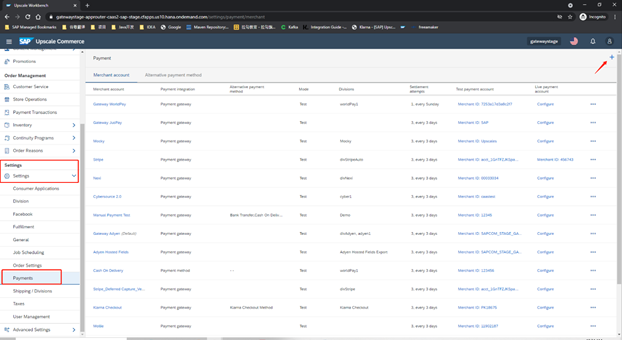
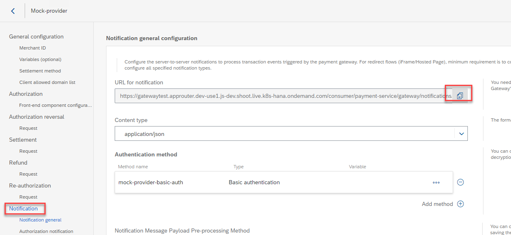

# Configuring Mock Gateway

## Download Postman Collection from Github Repository 

1. Download the postman collection Zip file of mock provider from [Postman Collection scripts](https://github.com/SAP-samples/upscale-commerce-open-payment-integration/tree/main/postman/mockProvider/payment-page).
2. Unzip the file.

## Create Merchant Account in Target Tenant
1. Log on to the target tenant.
2. Create a merchant account.

3. In the new quick creation page above, make sure the Payment Integration is set to Open payment framework – gateway.
4. Assign the division.
5. Save the Merchant ID in Payments, You can provide a random number for Merchant ID field. It will be updated when run postman collection configuration.

6. Copy notification URL.

7. Note down the Account Group ID and the Account ID, it's in the URL of the merchant account you just created for the mock gateway, they will be used in later steps when importing postman collection to the system. 

## Edit and Execute the Postman Collection 

1. Open Postman.
2. Import the two files at the same time to Postman.
3. Make sure to select the environment for Mock. 
4. Edit the value of the variables.
Variables that need value update:

   - Token:
     1. Go to Settings-> Consumer Applications.
     2. Create application configuration.
     3. Select External App. 
     4. Make sure Payment (read-write) is set for the accessible scopes. 
     
     5. Generate an access token for invoking the API call. For reference, see [making authorized API calls](https://help.sap.com/viewer/DRAFT/7aa2bd1ceea2469ba622451021826c37/DEV/en-US/446a3d417aac4bd8a301464670995ed3.html). 

   - RootUrl: The target tenant where you created the merchant account
     Note: when coping the url, remember to delete the “/” in the end
   - Account group ID
   - Account ID
   - host: Cybermock host
     Such as:
     - test env: cybermock-caas2-sap-test.cfapps.us10.hana.ondemand.com
     - Stage env: cybermock-caas2-sap-stage.cfapps.us10.hana.ondemand.com

5. Save and run the Postman Collection.

## License
Copyright (c) 2021 SAP SE or an SAP affiliate company. All rights reserved. This project is licensed under the Apache Software License, version 2.0 except as noted otherwise in the [LICENSE](LICENSES/Apache-2.0.txt) file.
